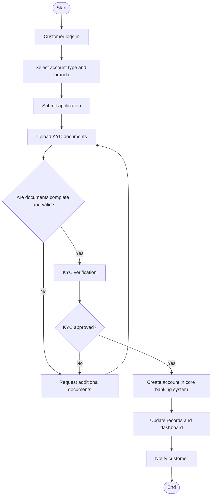

# lab requirement gathering

這個 Lab 可以整理成「**新客戶開戶 / 預約 / KYC 驗證流程**」的作業版本；模版雖然原本寫的是 **Order Management**，但內容可以直接替換成銀行 onboarding 流程來填寫。下面我已經幫你整理成可直接貼入的雙語版本，並附上 Mermaid flowchart 讓你可以快速畫圖或轉成 PNG。

***

## 這個 LAB 在做什麼

這個 Lab 的核心是在把 **retail bank 的 customer onboarding process** 具體畫成流程圖，重點包括：客戶送出開戶申請、上傳文件、KYC 驗證、補件、建立帳戶、通知結果。
它同時要求你注意 **UML flowchart 標準**、Yes/No decision paths，以及流程中可能出現的資料趨勢，例如 KYC verification success rate。
因為模板原始內容是 order management，所以你在作業中要把 stage 名稱改成銀行情境，不要照抄原模板字樣。

***

## Task 1：流程理解表

以下是可直接貼入模板的版本，已改成銀行場景。

| Stage | Description | Department involved | Key actions | Decision points |
|---|---|---|---|---|
| Request Account Opening | Customer starts the onboarding journey through the online portal or branch. | Customer Service / Digital Channel | Log in, choose account type, select preferred branch or digital onboarding. | Is the customer authenticated? |
| Submit Application | Customer fills in personal details and submits the account request. | Customer Service / Onboarding Team | Enter personal information, contact details, and initial application data. | Is the application form complete? |
| Upload KYC Documents | Customer uploads identity and address verification documents. | KYC / Compliance | Upload ID proof, address proof, and supporting documents. | Are the KYC documents valid and readable? |
| KYC Verification | Bank verifies identity, document authenticity, and compliance requirements. | Compliance / Risk / KYC Team | Check documents, screen customer, validate against policy and RBI rules. | Is KYC complete and approved? |
| Request Additional Documents | If required, the bank asks the customer to submit missing or unclear documents. | KYC / Customer Service | Notify customer, request updated files, track pending items. | Are additional documents received? |
| Create Account | Once verification is approved, the account is created in the core banking system. | Core Banking / Operations | Create customer record, assign account number, update system. | Is account creation successful? |
| Notify Customer | Customer receives confirmation of account creation and next-step instructions. | Customer Service / Notification System | Send SMS, email, or portal notification. | Has confirmation been delivered successfully? |

***

## Task 2：Key Components

以下是「關鍵階段」的精簡版，可直接貼入模板。 

| Stage | Description |
|---|---|
| Request Account Opening | Customer initiates the onboarding process and selects account preferences. |
| Submit Application | Customer provides required personal and contact information. |
| Upload KYC Documents | Customer submits identity and address verification documents. |
| KYC Verification | Bank reviews documents and checks compliance requirements. |
| Request Additional Documents | Missing or invalid documents are requested from the customer. |
| Create Account | Approved applications are created in the core banking system. |
| Notify Customer | The customer is informed that the account has been created successfully. |

***

## Task 3：Flowchart 結構

你可以用下面這個流程當作圖的主幹。這個版本已經包含 start/end、action、decision、loop back，符合一般 UML / flowchart 邏輯。 

***

## 視覺設計建議

你在 Lucidchart / Visio / Draw.io 畫圖時，可以這樣配色： 
- **Blue**：Start / End  
- **Green**：Action steps，例如 Customer logs in、Upload KYC documents、Create account  
- **Yellow**：Decision points，例如 Are documents complete and valid?、KYC approved?  

這樣做的好處是，老師一眼就能看出哪裡是操作、哪裡是判斷點。 

***

## 填寫邏輯

這份作業最好按照這個順序填：  
1. 先寫 **Stage**。  
2. 再寫 **Description**。  
3. 接著補 **Department involved**。  
4. 再列 **Key actions**。  
5. 最後寫 **Decision points**。  

這樣可以避免流程亂掉，也比較符合實際 banking workflow。 

***

## 自我審核清單

交作業前，建議你檢查這些項目： 
- 每個 decision point 都有 **Yes / No** 路徑。  
- 流程有從 **Start** 到 **End**。  
- KYC 失敗時有回到補件流程。  
- 各部門分工清楚。  
- 圖中沒有重複或多餘步驟。  
- 用詞一致，全部都對應到銀行 onboarding 場景。  
- 如果老師要求 UML compliance，圖形符號要符合：oval、rectangle、diamond。 

***

## 可直接貼入版本

如果你要交得更像正式作業，可以直接用這段英文描述放在表格前面：

**Task 1:** This flowchart describes the customer onboarding process for a retail bank, from account request to KYC verification, account creation, and customer notification. The process includes authentication, document upload, compliance review, decision points for document validity and KYC approval, and system updates in the core banking platform. 

***

我也可以下一步直接幫你做成：  
1. **完整可貼入 Word 的正式作業版**  
2. **中英雙語版表格**  
3. **更像 Lucidchart 的流程圖節點清單**